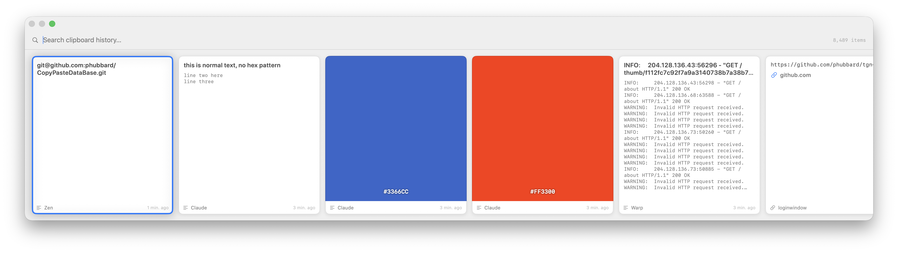

# cpdb

[](https://github.com/phubbard/CopyPasteDataBase/actions/workflows/tests.yml)

A from-scratch, native Swift replacement for the macOS clipboard app
[Paste](https://pasteapp.io) (`com.wiheads.paste`). Infinite disk-backed
clipboard history, SQLite + FTS5 incremental search, on-device OCR + image
classification via Apple's Vision framework, Quick Look previews, lossless
`NSPasteboard` fidelity, and a one-shot importer for your existing Paste
database.



## Status

| Release | Theme | State |
|---|---|:-:|
| **1.0.0** | Headless core + menu-bar app + global hotkey + non-activating popup + paste-into-previous-app + Paste.db importer + CLI | ✅ |
| **1.1.x** | Full-width popup · per-kind rendering (text, link, image, file, colour) · thumbnail generation on capture · `regenerate-thumbnails` backfill | ✅ |
| **1.2.x** | On-device OCR (`.accurate`) + image classifier folded into FTS5 · scope toggles (text · OCR · tags) in popup · match-source badges · configurable OCR languages · password-manager blocklist with 5-second frontmost-app history | ✅ |
| **1.3.x** | Quick Look previews (⌘Y or Space-when-empty) for text/image/file entries · single-window Finder-like model · optional "remember scroll position" across QL round-trips | ✅ |
| **2.0.0** | CloudKit sync across Macs (Private DB custom zone, silent-push subscriptions, content-addressed CKRecord IDs) · full-fidelity flavor CKAsset sync · iCloud-mirrored OCR text + image tags + thumbnails · About window with live sync progress + library stats · Preferences iCloud pane (pause, reset, re-push) · multi-Mac deploy script · git-sha build IDs · app icon · bundle id rename `local.cpdb` → `net.phfactor.cpdb` with one-time data migration | ✅ |
| 2.x | iOS companion (search + push-to-Mac via `ActionRequest` records), notarised build, garbage collection of v2.0 wire-format orphans on the CloudKit zone | ⏳ |

## Features

- **Lossless capture.** Every `NSPasteboardItem` UTI and flavor is stored
  verbatim. Restore puts the full multi-flavor entry back on the pasteboard
  so copying RTF out of TextEdit still pastes as RTF into Pages.
- **On-device OCR + image tags.** Every image entry passes through Apple's
  Vision framework (`VNRecognizeTextRequest.accurate` +
  `VNClassifyImageRequest`) on capture. Extracted text and classifier tags
  are folded into the same FTS5 index as plain text, so you can find
  screenshots by their contents. No network, no model bundling.
- **Quick Look.** Press `⌘Y` or `Space` (when the search field is empty) on
  a selected card to pop the entry into Apple's full Quick Look panel —
  full-resolution images, scrollable multi-page text, real PDF/Keynote
  rendering for file entries whose underlying file still exists.
- **Instant FTS5 search.** SQLite FTS5 with per-column scope toggles
  (`text` · `OCR` · `tags`) and bm25 ranking. Matching hits get a small
  coloured badge telling you which column they came from.
- **Rich per-kind rendering.** Text shows full content (no ellipsis), links
  show their full URL in primary colour at the top, images render their
  thumbnail, image files render the actual file, and `#RRGGBB` strings
  render as colour swatches even when captured as plain text.
- **Password-manager blocklist.** `com.apple.Passwords` /
  `com.apple.keychainaccess` are skipped by default, **including** the
  ~50 ms race window where Passwords has dismissed its sheet before our
  poll sees it (we track 5 seconds of frontmost-app activations, not just
  the current frontmost). Plus an Apple-Strong-Password shape heuristic as
  a safety net.
- **Respects `nspasteboard.org` transient markers** — 1Password, Bitwarden,
  Universal Clipboard, etc. opt out via UTI flags and cpdb honours them.
- **Content-addressed blob spillover.** Flavors ≥ 256 KB spill to
  `blobs/<ab>/<cd>/<sha256>` fan-out so identical pastes across days share
  a single on-disk copy.
- **One-shot Paste.db importer.** Ingests
  `~/Library/Application Support/com.wiheads.paste/Paste.db` — Core Data
  transformable blobs, external-storage references under `.Paste_SUPPORT/`,
  all five Paste entity kinds, pinboards, source apps. Idempotent.
- **CloudKit sync across your Macs (2.0).** Every entry — metadata,
  thumbnails, full NSPasteboardItem flavors (as `CKAsset`s), OCR text,
  image tags — mirrors to your iCloud Private Database. Install on a
  second Mac signed into the same iCloud account and your whole history
  appears. Uses a custom zone + content-addressed CKRecord IDs +
  server change tokens + APNs silent-push subscriptions for
  near-real-time pull. Pulled entries paste back with full multi-flavor
  fidelity — RTF, images, custom UTIs, everything. Your data, your
  iCloud, no servers we operate. Progress and controls live under About
  cpdb → iCloud sync / Preferences → iCloud sync.
- **Local-first, no third-party cloud, no telemetry.** Everything lives
  under `~/Library/Application Support/net.phfactor.cpdb/` on your
  machine. CloudKit usage is opt-in via the app's entitlements (only
  kicks in if you're signed into iCloud) and stays inside your own
  Private Database.

## Building

Requires Xcode (for `swift-testing`'s runtime framework and the `#Preview`
macro plugin that `KeyboardShortcuts` uses). Apple Silicon, macOS 14+.

```sh
git clone git@github.com:phubbard/CopyPasteDataBase.git cpdb
cd cpdb
make install-app        # builds, signs, installs to /Applications
open -a cpdb
```

First launch pops Preferences so you can pick a global hotkey. The
popup-to-paste path also needs **Accessibility** permission
(System Settings → Privacy & Security → Accessibility → enable cpdb) so
the synthesised `⌘V` lands in the app you were using.

To build just the CLI:

```sh
swift build -c release            # produces .build/release/cpdb
```

### Multi-Mac install (CloudKit sync, 2.0-dev)

CloudKit needs a real signing identity + provisioning profile. One-time
setup in Apple Developer:

1. Register an iCloud container named `iCloud.net.phfactor.cpdb`.
2. Register each Mac by its Provisioning UDID
   (`system_profiler SPHardwareDataType | grep "Provisioning UDID"` —
   **not** the Hardware UUID, they differ on Apple Silicon).
3. Generate a provisioning profile authorising the container + Push
   Notifications + all device UDIDs. Download as
   `cpdb.provisionprofile` at the repo root (gitignored).

Then from your build machine:

```sh
./deploy.sh hostname-a hostname-b …     # SSH-based; rebuild, scp .app, relaunch
```

Each remote Mac needs: same iCloud account signed in, SSH public-key
access from the build machine, matching UDID in the profile. On first
launch of the remote, the app captures locally, subscribes to the
shared CloudKit zone, and pulls your full history. Use the menu bar's
**Pull from iCloud** item to force a drain if the periodic timer hasn't
fired yet.

## Usage

### Popup

Press your hotkey from any app:

| Key | Action |
|---|---|
| `←` / `→` | Move selection between cards |
| Any printable | Filter via FTS5 (search field has focus by default) |
| `Return` | Paste the selected entry back into the app you were using |
| `⌘Y` | Quick Look the selected entry (any time) |
| `Space` | Quick Look — only when the search field is empty |
| `Esc` | Dismiss popup |
| Click outside | Dismiss popup |

Opening Quick Look **dismisses the popup** and makes QL the foreground
window (Finder-style single-window model). Dismiss QL with Esc or Space;
focus returns to the app you were in before summoning cpdb.

In the popup header, three small capsule toggles gate which FTS columns the
search query consults: **text**, **OCR**, **tags**. Defaults to all three
on; your preference is remembered. Matching cards show a coloured corner
chip (`OCR`, `tag`, `•••`) when a hit came from something other than the
primary text column.

### CLI

The `cpdb` binary is a full peer to the menu-bar app and shares the same
database. The app and CLI are coordinated by a `flock(2)` lock at
`~/Library/Application Support/net.phfactor.cpdb/daemon.lock` — whichever
starts first owns clipboard capture, the other reports the conflict and
exits. The CLI is NOT shipped inside the signed .app bundle (nested
binaries with restricted entitlements need their own provisioning
profile which isn't worth it for a debug tool); run the local
`swift build -c release` output instead.

```sh
cpdb list                                 # 20 most recent
cpdb list --kind image
cpdb search 'github'                      # FTS5, with highlighted snippets
cpdb show 8439                            # full entry detail incl. every UTI
cpdb copy 8439                            # rebuild back onto the pasteboard
cpdb stats                                # counts + disk usage

cpdb daemon                               # headless capture (use when the app isn't running)

cpdb import                               # ingest ~/Library/.../com.wiheads.paste/Paste.db

cpdb regenerate-thumbnails [--force]      # backfill image thumbnails; reclassifies
                                          #   kind=file entries that have image payload
cpdb analyze-images [--force] [--languages en-US fr-FR]
                                          # OCR + classify every image entry
cpdb forget-source-app com.apple.Passwords [--dry-run]
                                          # hard-delete everything ever captured
                                          # from a given app

cpdb gc                                   # VACUUM the database
cpdb --version

cpdb sync status                          # push-queue depth + last pull time
cpdb sync push-once                       # drain one batch to CloudKit
cpdb sync pull-once [--reset]             # pull all remote changes
```

## Preferences

Accessed from the menu-bar item. Sections:

- **Hotkey** — `KeyboardShortcuts.Recorder` for the global summon binding
- **Startup** — launch-at-login via `SMAppService`
- **Popup** — "Remember position when opening Quick Look" toggle
- **Image analysis** — OCR language picker (multi-select from Vision's
  supported languages), tag confidence threshold slider, "Re-analyze all
  images…" button (shells out to `cpdb analyze-images --force`)
- **Accessibility** — grant-status indicator + deep link to System Settings
- **Storage** — database path + size + entry counts

## Storage layout

```
~/Library/Application Support/net.phfactor.cpdb/
├── cpdb.db                 # SQLite (WAL mode)
├── cpdb.db-wal
├── cpdb.db-shm
├── daemon.lock             # flock(2) — one writer between app/CLI
└── blobs/
    └── ab/cd/<sha256>      # content-addressed spill for flavors ≥ 256 KB

~/Library/Caches/net.phfactor.cpdb.app/
└── quicklook/              # ephemeral Quick Look temp files

~/Library/Logs/cpdb/        # launchd stdout/stderr when running via LaunchAgent
```

Upgrading from 1.x: on first launch, the app moves your
`~/Library/Application Support/local.cpdb/` directory to
`~/Library/Application Support/net.phfactor.cpdb/` automatically. If
both paths exist (never should), it refuses and logs a warning —
resolve manually.

System log subsystem: `log show --predicate 'subsystem == "net.phfactor.cpdb"'`

## How capture works

macOS provides no clipboard-change notification, so cpdb polls
`NSPasteboard.general.changeCount` every 150 ms on a background dispatch
queue. Each change is canonicalised (SHA-256 over length-prefixed,
UTI-sorted flavor payloads) for dedup and persisted alongside the
frontmost-app bundle ID, a device identifier, and (for images) Vision OCR
+ classifier output.

**Password-manager protection** is layered:

1. UTI-based: entries carrying `org.nspasteboard.ConcealedType` /
   `TransientType` are dropped (community convention).
2. Source-app-based: entries where `com.apple.Passwords` /
   `com.apple.keychainaccess` was frontmost at capture time OR within the
   previous 5 seconds are dropped. The 5-second window catches the fact
   that Apple's Passwords sheet dismisses itself in ~50 ms, before our
   poll samples the frontmost app.
3. Shape-based: plain-text entries matching Apple's Strong Password format
   (three hyphen-separated groups of 6 alphanumerics) are refused even if
   neither of the above triggers.

## How the importer works

Paste is a Core Data app with "Allows External Storage" enabled.
`ZSNIPPETDATA.ZPASTEBOARDITEMS` is a transformable BLOB whose first byte
signals storage mode:

- `0x01` — inline: remainder is a standard `bplist00` `NSKeyedArchiver` payload
- `0x02` — external: remainder is an ASCII UUID naming a file in
  `.Paste_SUPPORT/_EXTERNAL_DATA/`

The archived root is an `NSArray` of `PasteCore.PasteboardItem` objects —
Paste's own `NSSecureCoding` class. cpdb decodes without linking Paste by
registering a shim class via `NSKeyedUnarchiver.setClass(_:forClassName:)`.
See
[`Sources/CpdbCore/Import/TransformablePasteboardDecoder.swift`](Sources/CpdbCore/Import/TransformablePasteboardDecoder.swift).

Kind mapping follows Paste's `Z_ENT` numbering (7 Color, 8 File, 9 Image,
10 Link, 11 Text). Source apps, pinboards, and device rows all map across.
Paste's pre-computed `ZPREVIEW` / `ZPREVIEW1` JPEGs are copied into
`previews.thumb_small` / `thumb_large` verbatim. OCR and classifier tags
are not backfilled at import — run `cpdb analyze-images` afterwards.

## Project layout

```
Sources/
├── cpdb/                    # CLI target (ArgumentParser)
│   └── Commands/Sync.swift      cpdb sync {status,push-once,pull-once}
├── CpdbApp/                 # menu-bar app target (SwiftUI)
│   ├── Popup/                   NSPanel + SwiftUI root
│   │   └── Cards/                   per-kind renderers
│   ├── QuickLook/               QLPreviewPanel coordinator
│   ├── Actions/                 PasteAction (CGEvent ⌘V), Accessibility
│   ├── MenuBar/                 NSStatusItem (Sync Now, Pull from iCloud)
│   ├── Hotkey/                  KeyboardShortcuts glue
│   ├── Preferences/             Settings window
│   ├── About/                   SwiftUI About with iCloud status + last sync
│   └── Resources/
│       ├── Info.plist               LSUIElement=true + CloudKit icon
│       ├── cpdb.entitlements        iCloud + CloudKit + APNs + app-id
│       └── Assets/AppIcon.icns      generated by scripts/make-icon.swift
├── CpdbShared/              # cross-platform core (iOS + macOS)
│   ├── Store/                   GRDB schema (v1/v2/v3), records, BlobStore
│   ├── Capture/                 CanonicalHash, Thumbnailer, PasteboardSnapshot
│   ├── Analysis/                Vision OCR + classifier pipeline, AnalysisPrefs
│   ├── QuickLook/               QuickLookItemBuilder (kind → URL)
│   ├── Search/                  FtsIndex, EntryRepository
│   ├── Sync/                    CloudKitSyncer actor, CloudKitClient protocol,
│   │                            PushQueue, CKSchema, EntryRecordMapper
│   ├── BuildStamp.swift         git-sha build identifier (generated)
│   └── Version.swift            marketing version (hand-edited)
└── CpdbCore/                # macOS-only library, depends on CpdbShared
    ├── Capture/                 PasteboardWatcher, Ingestor, IgnoredApps,
    │                            FrontmostAppMonitor
    ├── Restore/                 Restorer (legacy shim over PasteboardWriter)
    └── Import/                  PasteDbImporter + decoder + reader

Tests/CpdbCoreTests/         # swift-testing — 69 tests covering CloudKit
                             # mapper, syncer push + pull paths, and all
                             # pre-existing store/search/analysis suites

Makefile                      # build-app / install-app / release / stamp-build
scripts/make-icon.swift       # regenerate Contents/Resources/AppIcon.icns
scripts/stamp-build.sh        # write git short-sha into BuildStamp.swift
deploy.sh                     # SSH multi-Mac deploy
cpdb.provisionprofile         # (gitignored) Apple dev profile for signing
.github/workflows/tests.yml   # CI on macos-15
.github/workflows/release.yml # auto GitHub release on tag push
```

## Tests

```sh
swift test
```

Command Line Tools alone can't run `swift-testing`; route via Xcode:

```sh
DEVELOPER_DIR=/Applications/Xcode.app/Contents/Developer swift test
```

A handful of tests depend on a real `Paste.db` fixture and skip cleanly if
it isn't present (CI skips them).

## Dependencies

- [GRDB.swift](https://github.com/groue/GRDB.swift) — SQLite + FTS5 + migrator
- [swift-argument-parser](https://github.com/apple/swift-argument-parser) — CLI
- [KeyboardShortcuts](https://github.com/sindresorhus/KeyboardShortcuts) — global hotkey + SwiftUI recorder

Everything else is stdlib / AppKit / SwiftUI / Vision / Quartz / CloudKit.

## Versioning

Two layers:

- **Marketing version** — hand-edited in
  `Sources/CpdbShared/Version.swift` (`CpdbVersion.marketing`) and mirrored
  in `Info.plist`'s `CFBundleShortVersionString`. Bump when cutting a
  release (1.3.2 → 2.0.0 → …). `make verify-version` fails the build on
  drift.
- **Build identifier** — automatically appended to the marketing version
  with a git short-sha (e.g. `2.0.0-dev+8ea2418`). `scripts/stamp-build.sh`
  regenerates `BuildStamp.swift` before every Makefile build and
  `Info.plist`'s `CFBundleVersion` gets patched to match. Use it to
  identify exactly which commit produced the binary on each installed
  Mac — the About window shows the full build id. When the tree is
  dirty, the sha gets a `-dirty` suffix.

```sh
# cutting a release
# 1. edit Sources/CpdbShared/Version.swift  (CpdbVersion.marketing)
# 2. edit Sources/CpdbApp/Resources/Info.plist (CFBundleShortVersionString only —
#    CFBundleVersion is regenerated on every build)
make verify-version
git commit -am "bump version to X.Y.Z"
git tag -a vX.Y.Z -m "..."
git push && git push --tags
```

The release workflow fires automatically on tag push and creates a
GitHub release with auto-generated notes.
