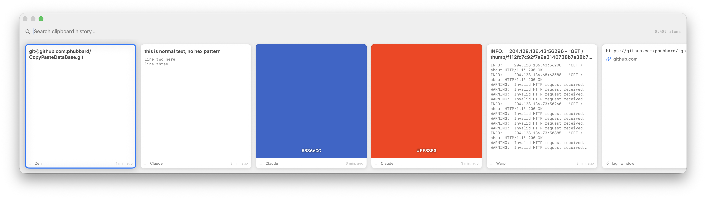
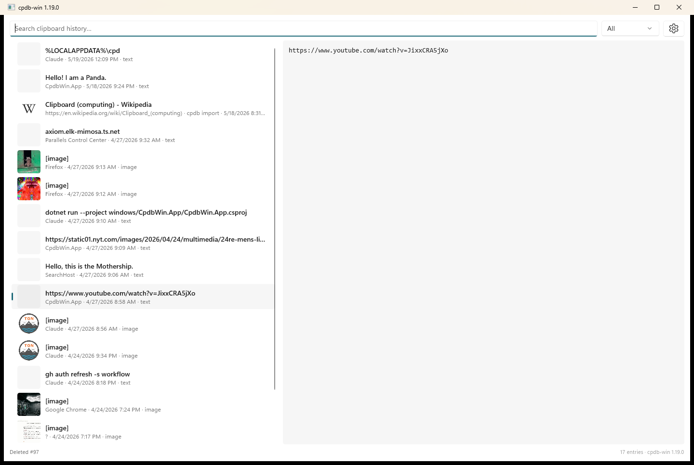

# cpdb

**CI**

[](https://github.com/phubbard/CopyPasteDataBase/actions/workflows/tests.yml)
[](https://github.com/phubbard/CopyPasteDataBase/actions/workflows/windows-tests.yml)

**Supported platforms**

| Platform | Architecture | Ship vehicle |
|---|---|---|
|  | Apple Silicon | Universal `.dmg` ([latest release](https://github.com/phubbard/CopyPasteDataBase/releases/latest)) |
|  | Intel | Universal `.dmg` (same binary as arm64) |
|  | iPhone | Xcode build from `iOS/cpdb/` (no public TestFlight yet) |
|  | Intel / AMD | Velopack `Setup.exe` ([latest release](https://github.com/phubbard/CopyPasteDataBase/releases/latest)) |
|  | Snapdragon X / Surface | Velopack `Setup.exe` (separate per-RID artifact) |

A cross-platform clipboard history that lets you **find anything you've
ever copied** — including text inside screenshots, content of images,
and the actual page titles of URLs — and keeps your data in a **standard
SQLite file you can open with any tool**.

Native on **macOS**, **iOS**, and **Windows**, all running the same
schema and the same search semantics. Local-first; no third-party
cloud, no telemetry, no lock-in. Optional iCloud sync stays inside
your own iCloud Private Database — no servers we operate.

Started as a from-scratch Swift replacement for the macOS app
[Paste](https://pasteapp.io) (and still ships the one-shot Paste.db
importer for migration); the engine and storage layer have since
been ported to iOS and Windows.



## Status

| Release | Theme | State |
|---|---|:-:|
| **1.0.0** | Headless core + menu-bar app + global hotkey + non-activating popup + paste-into-previous-app + Paste.db importer + CLI | ✅ |
| **1.1.x** | Full-width popup · per-kind rendering (text, link, image, file, colour) · thumbnail generation on capture · `regenerate-thumbnails` backfill | ✅ |
| **1.2.x** | On-device OCR (`.accurate`) + image classifier folded into FTS5 · scope toggles (text · OCR · tags) in popup · match-source badges · configurable OCR languages · password-manager blocklist with 5-second frontmost-app history | ✅ |
| **1.3.x** | Quick Look previews (⌘Y or Space-when-empty) for text/image/file entries · single-window Finder-like model · optional "remember scroll position" across QL round-trips | ✅ |
| **2.0.0** | CloudKit sync across Macs (Private DB custom zone, silent-push subscriptions, content-addressed CKRecord IDs) · full-fidelity flavor CKAsset sync · iCloud-mirrored OCR text + image tags + thumbnails · About window with live sync progress + library stats · Preferences iCloud pane (pause, reset, re-push) · multi-Mac deploy script · git-sha build IDs · app icon · bundle id rename `local.cpdb` → `net.phfactor.cpdb` with one-time data migration | ✅ |
| **2.5.x** | iOS companion app (search + Quick Look + push-to-Mac via `ActionRequest` · share-sheet · swipe-to-delete · live updates via silent push + scene-phase pull + BGAppRefreshTask + foreground poll · link badges + URL-shaped text reclassification · kind-filter chips) · Mac right-click context menu (Quick Look · Share · Delete) · single-entry delete + tombstone push · cross-device pull dedup (Universal-Clipboard echoes collapse) · event-driven push (`Ingestor` notification → immediate `pushPendingChanges`) · configurable safety-net poll interval (Preferences, 5 min – 24 h, default 15) · `cpdb dedupe` + `cpdb backfill-titles` cleanup commands | ✅ |
| **2.6.x** | Pinning · storage usage diagnostic · time-window flavor-body eviction · `cpdb fixture` test scaffolding · cross-platform parity contracts (`docs/schema.md` + `docs/parity.md`) | ✅ |
| **2.7.x** | Background-fetched link titles (YouTube oEmbed + HTML og:title scrape, indexed in FTS5; `cpdb fetch-link-titles` CLI) | ✅ |
| **2.8.0–2.8.6** | Link metadata enrichment — preview thumbnails (og:image / twitter:image / Wikipedia REST API / favicon-fallback) · live popup updates while backfill runs · capture-wake immediate enrichment · hover tooltips with source app + device + timestamp · URL-shaped text reclassifies to `kind=link` · `loginwindow` ignore + cross-time link dedupe · "Retry empties" + transient-error handling · single-instance guard · popup close button · unified Permissions section with live `NWBrowser` Local Network probe · exponential-backoff retry (1·2^n min, 60-min cap) · NWPathMonitor reachability gate · bot-check / CAPTCHA detection · Reddit JSON API path · iOS list rows render link titles + thumbnails | ✅ |
| 2.9+ | Browse window (full-screen, tiled, scrolling grid) · App Store submission for the iOS companion · garbage collection of pre-v2.1 wire-format orphans on the CloudKit zone · size-budget eviction | ⏳ |
| **3.0.0 — Canonical-hash v2** | Semantic content identity (image → file → url → normalized text → fallback) replacing the full-flavor-set SHA-256, so volatile sidecar flavors can't fork an entry's identity. New CloudKit zone `cpdb-v3`; one-time resumable, backed-up migration on first launch (chunked rehash → collision merge → reseed, behind the `cpdb-v3.db` skew fence); §5.3 pull-side conflict resolution; faster sync drain. Design + evidence: [`docs/canonical-hash-v2.md`](docs/canonical-hash-v2.md). All three Macs migrated + verified (**0 hash mismatches**) | ✅ |
| **iOS read/write** | Promote the iOS companion from read-only to a clipboard *writer* (text/links first), routing through the same v2 [`ContentIdentity`](Sources/CpdbShared/Capture/ContentIdentity.swift) engine so captures converge with the Macs. Capture behind a default-off toggle; `detectPatterns`-gated reads (no spurious "pasted from" banners). Compiles for iOS. Remaining: images/files, foreground-capture UX, App Store privacy manifest | ✅ merged |
| **Undo (delete + pin)** | Reversible delete + pin on Mac (⌘Z/⌘⇧Z, with a transient hint) and iOS (undo snackbar + shake-to-undo). Multi-level [`UndoCoordinator`](Sources/CpdbShared/UndoCoordinator.swift) stack. Cross-device-correct via a `modified_at` last-writer-wins column (v11) — an undone delete propagates instead of staying deleted on a sibling | ✅ |
| **Relay sync substrate** | Cross-platform replacement for CloudKit. Phase A done: blind-PSK protocol spec ([`docs/relay-protocol.md`](docs/relay-protocol.md)) + Worker scaffold ([`cpdb-relay/`](cpdb-relay/)). Deep design review complete ([`docs/relay-deep-analysis.md`](docs/relay-deep-analysis.md)): Cloudflare confirmed at $0/mo, hybrid topology (CloudKit stays for Apple, relay bridges Windows), but v1 spec found unimplementable as written — a v2 protocol revision (meta/body split, seq change-log, IETF ChaCha20-Poly1305, reseed-as-migration) is the next step; the Windows hash-v2 gate is satisfied as of v1.38.0. Accounts/tiers/OAuth design parked in [`docs/relay-v2-accounts-roadmap.md`](docs/relay-v2-accounts-roadmap.md) — deferred, clients not started | ⏳ |
| **cpdb-win 1.x** | Standalone Windows port — C# / .NET 8 / WinUI 3, same SQLite + FTS5 schema (v1–v9 migrator), link-metadata enrichment, import/export, global hotkey + paste-back, Velopack `Setup.exe` + client-side delta auto-update (x64 + arm64). No cross-device sync in v1; on-device OCR/image-tags still pending (`Windows.Media.Ocr`). Schema kept bit-compatible (see [`docs/schema.md`](docs/schema.md)) so future sync paths stay open — note canonical-hash v2 is a pending Windows catch-up ([`docs/handoffs/windows-hash-v2.md`](docs/handoffs/windows-hash-v2.md)): Windows still computes the v1 full-flavor hash and the migrators have diverged at v10. See the [Windows section](#windows-cpdb-win) | ✅ shipping / OCR + hash-v2 ⏳ |

## Features

### Find anything you've ever copied

- **On-device OCR.** Every image entry runs through Apple's Vision
  (`VNRecognizeTextRequest.accurate`) on Mac/iOS, or
  `Windows.Media.Ocr` on Windows. Extracted text is folded into the
  same FTS5 index as plain text, so a search for `"flight 1138"` finds
  the boarding-pass screenshot from six months ago. No network, no
  cloud upload, no model bundling on Apple platforms.
- **Image classification tags.** Vision's `VNClassifyImageRequest` on
  Mac/iOS / a bundled **MobileNetV2** ImageNet-1k ONNX (~13 MB) on
  Windows. Top tags land in the `image_tags` column so a search for
  `dog` surfaces the photo of your dog even though "dog" appears
  nowhere in any caption.
- **Background-fetched link metadata.** Captured URLs grow their real
  page title (YouTube oEmbed, Reddit JSON API, WordPress-aware
  `<title>` precedence, generic og:title scrape) and preview
  thumbnails (og:image / twitter:image / Wikipedia REST / favicon
  fallback) within seconds, indexed in FTS5. Search `"santa cruz vala"`
  and the YouTube URL you copied surfaces by the video's title even
  though the URL itself is opaque.
- **FTS5 full-text search with per-column scope toggles** — match on
  text, OCR, tags, link title, app name, or any combination. bm25
  ranking. Match-source badges on cards tell you which column the
  hit came from.

### Open by design — your data, your tools

- **Plain SQLite + FTS5.** Your entire library is one
  `cpdb.db` file. Open it with `sqlite3`, DB Browser, Datasette,
  anything that speaks SQLite. The schema is documented end-to-end in
  [`docs/schema.md`](docs/schema.md) as the cross-platform contract.
  Same schema, same migrator (v1–v9), same FTS5 tokenizer chain on
  every platform.
- **`cpdb import-urls`** seeds your library from a text file of URLs
  (one per line; http/https/file). They're ingested as if you'd
  copied them yourself, so link enrichment kicks in. Great for
  importing a bookmarks export or a read-later list.
- **`cpdb export --format md|csv|html`** writes a portable archive
  with every enrichment field carried through — fetched title, full
  OCR text (not truncated), image tags. CSV is RFC-4180. Markdown is
  paragraph-per-entry. HTML is self-contained with dark mode.
- **One-shot Paste.db importer** ingests an existing
  `com.wiheads.paste/Paste.db` — Core Data transformable blobs,
  external-storage references, all five Paste entity kinds,
  pinboards, source apps. Idempotent.
- **Local-first, no telemetry, no third-party cloud.** Everything
  lives in a known directory on your machine. The optional iCloud
  sync (Mac/iOS) targets *your* iCloud Private Database — no
  servers we operate, no analytics, no account to sign into.

### Cross-platform — same engine, same data

- **One schema across Mac/iOS/Windows.** The v1–v9 migrator is
  identical; capture-time canonical-hash dedup uses the same byte
  layout (test vectors in `Tests/CpdbCoreTests/HashVectors.swift`);
  search semantics match. A library written by the Mac and read on
  Windows looks the same.
- **iOS companion** (search + Quick Look + "Push to Mac" paste). No
  iOS-side capture (clipboard access is hostile on iOS; deliberate
  trade-off). Pulls from CloudKit.
- **Windows port** is feature-complete for capture, search, OCR,
  link enrichment, import/export, hotkey paste-back, and Velopack
  auto-update on x64 + arm64. Cross-platform sync substrate
  (replacing the Apple-only CloudKit path) is in design; see
  [`docs/relay-protocol.md`](docs/relay-protocol.md) and
  [`docs/relay-v2-accounts-roadmap.md`](docs/relay-v2-accounts-roadmap.md).
- **Cross-platform parity scoreboard** in [`docs/parity.md`](docs/parity.md)
  tracks what's shipping where with version stamps.

### Faithful capture + paste

- **Lossless multi-flavor capture.** Every `NSPasteboardItem` UTI and
  flavor (Mac) / clipboard format (Windows) is stored verbatim.
  Restore puts the full set back on the pasteboard so RTF copied out
  of TextEdit pastes as RTF into Pages, and an Excel cell range
  pastes back as a real cell range. A URL captured as a bare
  `public.url` (e.g. a Universal Clipboard echo) also gets a
  synthesized plain-text flavor on paste, so it lands in text fields
  too.
- **Quick Look** on Mac/iOS — `⌘Y` / Space-when-empty pops the full
  Quick Look panel: full-resolution images, scrollable multi-page
  text, real PDF/Keynote rendering for file entries whose underlying
  file still exists.
- **Rich per-kind rendering.** Text shows full content (no ellipsis),
  links show fetched title + thumbnail + URL, images render their
  thumbnail, image files render the actual file, and `#RRGGBB`
  strings render as colour swatches even when captured as plain text.
- **Password-manager blocklist.** `com.apple.Passwords` /
  `com.apple.keychainaccess` (Mac) and the Windows equivalents are
  skipped by default — including the ~50 ms race window where the
  source app dismissed its sheet before our poll sees it (we track
  5 seconds of frontmost-app activations). Plus an
  Apple-Strong-Password shape heuristic as a safety net on Mac.
- **Respects `nspasteboard.org` transient markers** — 1Password,
  Bitwarden, Universal Clipboard, etc. opt out via UTI flags and
  cpdb honours them.
- **Content-addressed blob spillover.** Flavors ≥ 256 KB spill to
  `blobs/<ab>/<cd>/<sha256>` fan-out so identical pastes across days
  share a single on-disk copy.

### Optional iCloud sync across your Apple devices

Mac ↔ Mac ↔ iOS via CloudKit Private Database. Every entry —
metadata, thumbnails, full multi-flavor payloads (as `CKAsset`s),
OCR text, image tags — mirrors to your iCloud account. Install on
a second Mac signed in to the same account and your whole history
appears. Uses a custom zone + content-addressed CKRecord IDs +
server change tokens + APNs silent-push subscriptions for
near-real-time pull. Pulled entries paste back with full
multi-flavor fidelity. Opt-in via the app's entitlements (only
engages if you're signed in to iCloud); stays inside your own
Private Database; you can pause, reset, or re-push from
Preferences → iCloud sync.

A future **cross-platform** sync substrate (Cloudflare Worker, end-
to-end encrypted, 8-word Diceware pairing) is in design so Windows
joins the same library — see the relay-protocol docs above.

## Installing

The fastest path is the signed, notarized DMG on the [latest GitHub
release](https://github.com/phubbard/CopyPasteDataBase/releases/latest).
Universal (arm64 + x86_64), so Apple Silicon and Intel Macs both work.

```sh
# Pick the version you want from the releases page, e.g. v2.5.8:
curl -LO https://github.com/phubbard/CopyPasteDataBase/releases/download/v2.5.8/cpdb-v2.5.8.dmg
open cpdb-v2.5.8.dmg          # drag cpdb.app into Applications
open -a cpdb
```

No Gatekeeper warnings, no right-click → Open dance — the DMG ships
through Apple's notary service.

## Building from source

Requires Xcode (for `swift-testing`'s runtime framework and the `#Preview`
macro plugin that `KeyboardShortcuts` uses). macOS 14+. Apple Silicon for
fast dev iteration; release artefacts are universal (arm64 + x86_64).

```sh
git clone git@github.com:phubbard/CopyPasteDataBase.git cpdb
cd cpdb
make install-app        # builds, signs, installs to /Applications
open -a cpdb
```

First launch pops Preferences so you can pick a global hotkey. The
popup-to-paste path also needs **Accessibility** permission
(System Settings → Privacy & Security → Accessibility → enable cpdb) so
the synthesised `⌘V` lands in the app you were using.

To build just the CLI (host arch only):

```sh
swift build -c release            # produces .build/release/cpdb-cli
```

To build a universal CLI that runs on both Apple Silicon and Intel:

```sh
make UNIVERSAL=1 build-cli        # → .build/apple/Products/Release/cpdb-cli
# or directly:
swift build -c release --arch arm64 --arch x86_64 --product cpdb-cli
```

`make release` always builds universally — the published `.app.zip` and
CLI binary on every GitHub release tag work on both architectures.

### iOS companion (3.x — read/write)

A SwiftUI iPhone app (project at `iOS/cpdb/cpdb.xcodeproj`,
sources at `iOS/cpdb/cpdb/`) that connects to the same CloudKit
Private Database as your Macs. **iOS never captures**; the
phone's clipboard stays on the phone. Build with Xcode and an
iPhone destination — there's no SPM target, the iOS app is a
real Xcode project consuming this repo as a Local Package
(`CpdbShared` only).

**What it does**

- Search clipboard history with the same FTS5 + bm25 ranking as the
  Mac. Kind-filter chips (Text · Link · Image · File · Color · Other)
  mirror the Mac popup's classification.
- Quick Look an entry — tap a row → detail view with full image,
  inline tappable URL autolinking via `NSDataDetector`, OCR /
  metadata.
- **Push to Mac.** Pick a sibling Mac, tap the desktop-arrow icon —
  iOS writes an `ActionRequest` CKRecord, the targeted Mac's syncer
  consumes it on the next pull and writes the entry's full
  multi-flavor payload to its `NSPasteboard`. Press ⌘V on that Mac.
- **Share-sheet** for any entry (text / URL / image bytes routed
  through SwiftUI `ShareLink` + Transferable).
- **Swipe-to-delete.** Tombstones propagate to your Macs within
  seconds via the iOS push path; blobs cleaned up later by `cpdb gc`.
- **Live updates** — three independent paths feed the UI so
  freshness doesn't depend on any single transport:
  1. **Silent push** (CKDatabaseSubscription) — fastest when APNs
     delivers; ms-to-seconds.
  2. **Scene-phase pull** — every time the app becomes active.
  3. **Foreground poll** — 30 s tick while the app is on-screen,
     belt-and-braces against APNs throttling.
  4. **`BGAppRefreshTask`** — iOS-granted background slot for
     periodic catch-up when the app is backgrounded.

**One-time signing setup** (Apple Developer portal):

1. Register the bundle id `net.phfactor.cpdb.ios`.
2. Enable iCloud (CloudKit) on it; select the existing
   `iCloud.net.phfactor.cpdb` container shared with the Macs.
3. Enable Push Notifications on the bundle id.
4. Register your iPhone's UDID; regenerate the provisioning profile.

Then in Xcode: open `iOS/cpdb/cpdb.xcodeproj`, pick your iPhone as
the destination, ⌘R. Automatic signing handles the rest.

### Multi-Mac install (CloudKit sync, 2.0-dev)

CloudKit needs a real signing identity + provisioning profile. One-time
setup in Apple Developer:

1. Register an iCloud container named `iCloud.net.phfactor.cpdb`.
2. Register each Mac by its Provisioning UDID
   (`system_profiler SPHardwareDataType | grep "Provisioning UDID"` —
   **not** the Hardware UUID, they differ on Apple Silicon).
3. Generate a provisioning profile authorising the container + Push
   Notifications + all device UDIDs. Download as
   `cpdb.provisionprofile` at the repo root (gitignored).

Then from your build machine:

```sh
./deploy.sh hostname-a hostname-b …     # SSH-based; rebuild universal, scp .app, relaunch
```

The script always builds universally (arm64 + x86_64) so the same
bundle runs on Apple Silicon AND Intel hosts — no surprises when
adding an Intel Mac to the fleet.

Each remote Mac needs: same iCloud account signed in, SSH public-key
access from the build machine, matching UDID in the profile. On first
launch of the remote, the app captures locally, subscribes to the
shared CloudKit zone, and pulls your full history. Use the menu bar's
**Pull from iCloud** item to force a drain if the periodic timer hasn't
fired yet.

### Windows (cpdb-win)

A **standalone** Windows clipboard manager that mirrors the Mac 1.x
single-machine experience — no cross-device sync in v1, but built on
the same SQLite + FTS5 schema so a future sync path stays open. It
ships and auto-updates today; sources live under
[`windows/`](windows/).



**Language & runtime**

- **C# / .NET 8**, target `net8.0-windows10.0.19041.0`.
- **WinUI 3** desktop app (unpackaged), via the Windows App SDK.
- Two RIDs shipped every release: **`win-x64`** and **`win-arm64`**
  (native — runs unemulated on Snapdragon X / Surface and on
  Windows-on-ARM VMs).

**Libraries**

- [Microsoft.WindowsAppSDK](https://learn.microsoft.com/windows/apps/windows-app-sdk/)
  `1.8` — WinUI 3 UI framework.
- [Microsoft.Data.Sqlite](https://learn.microsoft.com/dotnet/standard/data/sqlite/)
  `8.0` (bundled `e_sqlite3` with FTS5) — same store + search engine
  contract as GRDB on the Mac side.
- [Velopack](https://velopack.io) `0.0.1298` — `Setup.exe` installer
  **and** client-side delta auto-update over GitHub Releases
  (per-architecture channels).
- `Microsoft.Windows.SDK.BuildTools` — Win32 metadata.
- [xUnit](https://xunit.net) — **430+ tests** (`CpdbWin.Core.Tests`),
  run in CI on every push (Windows runner).
- Everything else is the .NET BCL + direct Win32 P/Invoke
  (clipboard, global hotkey, tray icon, foreground/paste-back,
  `SendInput`).

**Projects**

```
windows/
├── CpdbWin.Core/        engine: Store (SQLite/FTS5/Migrator/Gc),
│                        Capture, Ingest, Analysis (link metadata),
│                        Portability (UrlImporter/HistoryExporter)
├── CpdbWin.App/         WinUI 3 app: popup window, tray, hotkey,
│                        paste-back, auto-update, single-instance
├── CpdbWin.Cli/         console maintenance peer (no WinUI dep)
└── CpdbWin.Core.Tests/  xUnit
```

**Feature set (shipping)**

- **Clipboard capture daemon** with the byte-exact canonical
  `content_hash` dedup, inline/blob spillover at 256 KB, and the
  Windows-clipboard-format → UTI translation table from
  `docs/schema.md`.
- **Instant FTS5 search** + kind-filter (Text / Link / Image / File
  / Color / Other), schema **v1–v9 migrator** kept lock-step with
  macOS/iOS.
- **Link metadata enrichment** at parity with Mac 2.7–2.9: YouTube
  oEmbed + `og:title` scrape (with WordPress-aware precedence —
  rich `<title>` wins on WP pages), preview thumbnails
  (`og:image`/`twitter:image`/Wikipedia REST/favicon), exponential
  backoff, reachability gate, bot-check/CAPTCHA detection,
  CDN-throttle detection (tiny-body 200 + no title = transient),
  Reddit `.json` path, capture-wake immediate fetch, live card
  updates.
- **Pinning**, hover tooltips, per-kind rendering, link preview pane.
- **Global hotkey** summon → pick → **paste-back** into the app you
  came from (hidden window + synthetic Ctrl+V via `SendInput`).
- **Click selects · double-click / Enter copies**; Delete keeps your
  place + keyboard focus in the list.
- **Data portability**: URL-list import + Markdown/CSV/HTML export,
  one shared engine behind both the CLI and the Preferences pane,
  implementing the v2.9.6 export contract (explicit `fetched_title`
  / full OCR / image tags, LF-normalised, 13-col CSV).
- **Maintenance CLI** (`cpdb-win`): `reclassify-kinds`,
  `backfill-titles`, `dedupe --links-all-time`, `import-urls`,
  `export`.
- **Client-side auto-update** — prompt-not-silent, 30 s + daily +
  on-demand "Check for Updates…", per-arch Velopack channels off one
  GitHub release.
- **Single-instance guard**, tray icon with a stable GUID (survives
  updates), autostart that a dev build can't hijack, and
  boot-diagnostics + an empty-DB circuit breaker.

**Not yet** (tracked in [`docs/parity.md`](docs/parity.md)): on-device
OCR + image tags (planned via `Windows.Media.Ocr`), and any
cross-device sync (v1 is deliberately standalone).

**Install**: download `CpdbWin-<ver>-win-x64-Setup.exe` (or
`-win-arm64-`) from the [latest release](https://github.com/phubbard/CopyPasteDataBase/releases/latest)
and run it. SmartScreen will say "Unknown publisher" once (More info →
Run anyway); after that the app keeps itself current via the in-app
updater. Build from source: `pwsh windows/build-installer.ps1`
(see `windows/release-installer.ps1` for the release pipeline).

**Storage**: `%LOCALAPPDATA%\cpdb\` — `cpdb.db` (+ `-wal`/`-shm`),
`blobs/<ab>/<cd>/<sha256>`, and diagnostic logs (`update.log`,
`gc.log`, `paste-back.log`, `startup-crash.log`).

Schema parity is the strategic constraint, the same as iOS:

- [`docs/schema.md`](docs/schema.md) — canonical behaviour contract:
  DDL, kind classification, content_hash algorithm, blob spillover,
  Windows-clipboard-format → UTI translation table, per-feature
  semantics.
- [`docs/parity.md`](docs/parity.md) — cross-platform scoreboard:
  what's implemented where, with version stamps.

Keeping clients bit-compatible leaves every future sync path open
(shared-folder log sync, self-hosted server, CloudKit Web Services,
or plain `.sqlite` import/export). Windows development runs from a
Windows VM with its own Claude Code session; Mac + iOS continue from
macOS.

## Usage

### Popup

Press your hotkey from any app:

| Key | Action |
|---|---|
| `←` / `→` | Move selection between cards |
| Any printable | Filter via FTS5 (search field has focus by default) |
| `Return` | Paste the selected entry back into the app you were using |
| `⌘Y` | Quick Look the selected entry (any time) |
| `Space` | Quick Look — only when the search field is empty |
| `Delete` (fn+⌫) | Delete the selected entry (any time) |
| `⌫` Backspace | Delete the selected entry — only when the search field is empty (otherwise edits the query) |
| `⌘T` | Time-pivot — show neighbors of the selected card (entries captured within ±30 min, chronological). Works equally from a search hit or a normal recent-list selection |
| `[` / `]` | While in time-pivot mode: narrow / widen the window (15 min → 30 min → 1 h → 3 h → 6 h → 12 h → 1 day) |
| `Esc` | Dismiss popup |
| Click outside | Dismiss popup |

Opening Quick Look **dismisses the popup** and makes QL the foreground
window (Finder-style single-window model). Dismiss QL with Esc or Space;
focus returns to the app you were in before summoning cpdb.

In the popup header, three small capsule toggles gate which FTS columns the
search query consults: **text**, **OCR**, **tags**. Defaults to all three
on; your preference is remembered. Matching cards show a coloured corner
chip (`OCR`, `tag`, `•••`) when a hit came from something other than the
primary text column.

### CLI

The `cpdb` binary is a full peer to the menu-bar app and shares the same
database. The app and CLI are coordinated by a `flock(2)` lock at
`~/Library/Application Support/net.phfactor.cpdb/daemon.lock` — whichever
starts first owns clipboard capture, the other reports the conflict and
exits. The CLI is NOT shipped inside the signed .app bundle (nested
binaries with restricted entitlements need their own provisioning
profile which isn't worth it for a debug tool); run the local
`swift build -c release` output instead.

`cpdb help <subcommand>` prints the full flag set for any command;
the list below is the working reference.

**Browse & restore**

```sh
cpdb list                                 # 20 most recent (default subcommand)
cpdb list --kind image                    # filter by kind
cpdb search 'github'                      # FTS5, highlighted snippets
cpdb show 8439                            # full entry detail incl. every UTI
cpdb copy 8439                            # rebuild back onto the pasteboard
cpdb stats                                # counts + disk usage
cpdb storage                              # tiered byte breakdown (metadata /
                                          #   thumbnails / flavor bodies) + the
                                          #   live / pinned / evicted counts
cpdb --version
```

**Capture & import/export**

```sh
cpdb daemon                               # headless capture (when the app isn't running)
cpdb import                               # ingest ~/Library/.../com.wiheads.paste/Paste.db
cpdb import-urls FILE [--dry-run] [--spread-seconds N]
                                          # seed from one http(s)://|file:// URL
                                          #   per line; each treated as a clipboard
                                          #   copy so links enrich in the background.
                                          #   --spread-seconds backdates captured_at
                                          #   so the import doesn't collapse to one
                                          #   timestamp. #-comments + blanks skipped.
                                          #   Per-line isolated: a bad row counts as
                                          #   failed= and the batch continues.
                                          #   (Preferences → Import URLs… clusters
                                          #   imports at "now"; CLI defaults to no
                                          #   spread — pass --spread-seconds to
                                          #   backdate a bulk seed.)
cpdb export --format md|csv|html [--output PATH] [--limit N] [--include-evicted]
                                          # portable dump (metadata + text, no
                                          #   flavor bytes). stdout if no --output.
                                          #   Carries every enrichment field —
                                          #   fetched link/YouTube title, full
                                          #   (untruncated) OCR text, image tags —
                                          #   as explicit labelled fields. CSV is
                                          #   13-col RFC-4180. All embedded text is
                                          #   LF-normalised (no mixed endings).
```

**Maintenance**

```sh
cpdb regenerate-thumbnails [--force]      # backfill image thumbnails; reclassifies
                                          #   kind=file entries with image payload
cpdb analyze-images [--force] [--languages en-US fr-FR]
                                          # OCR + classify every image entry
cpdb fetch-link-titles [--limit N] [--force] [--retry-empty] [--dry-run]
                                          # background link-title/thumbnail backfill.
                                          #   --retry-empty re-tries only rows that
                                          #   came back empty (no full re-fetch).
cpdb reclassify-kinds [--dry-run]         # retro-fix kind=text rows that are
                                          #   actually single URLs → kind=link
cpdb dedupe [--dry-run] [--window 5.0] [--links-all-time]
                                          # collapse near-dup captures (same kind +
                                          #   trimmed text within window seconds).
                                          #   --links-all-time ignores the window
                                          #   for kind=link (catches loginwindow /
                                          #   multi-Mac phantoms days apart).
                                          # As of v2.10.1 the live capture path
                                          # uses a 30 s in-Ingestor dedup window
                                          # (fixes Chrome/Chromium pasteboard-token
                                          # jitter). Run `--window 30` once after
                                          # upgrading to collapse pre-existing dupes.
cpdb backfill-titles [--dry-run]          # one-off fix for the v2.5.0–2.5.2
                                          #   bare-file://-URL title regression
cpdb forget-source-app com.apple.Passwords [--dry-run]
                                          # hard-delete everything ever captured
                                          #   from a given app
cpdb evict --before-days N [--dry-run]    # discard flavor bodies older than N days
                                          #   (metadata + thumbnails kept; pinned
                                          #   entries skipped)
cpdb gc                                   # VACUUM the database
cpdb fixture {snapshot|list|env|path|delete} NAME
                                          # snapshot the live data dir to a named
                                          #   side copy for safe testing; `env`
                                          #   prints the CPDB_SUPPORT_DIR override
```

**Sync (CloudKit, macOS only)**

```sh
cpdb sync status                          # push-queue depth + last pull time
cpdb sync push-once                       # drain one batch to CloudKit
cpdb sync pull-once [--reset]             # pull all remote changes
```

## Preferences

Accessed from the menu-bar item. Sections:

- **Hotkey** — `KeyboardShortcuts.Recorder` for the global summon binding
- **Startup** — launch-at-login via `SMAppService`
- **Popup** — "Remember position when opening Quick Look" toggle
- **Image analysis** — OCR language picker (multi-select from Vision's
  supported languages), tag confidence threshold slider, "Re-analyze all
  images…" button (shells out to `cpdb analyze-images --force`)
- **Accessibility** — grant-status indicator + deep link to System Settings
- **Storage** — database path + size + entry counts

## Storage layout

```
~/Library/Application Support/net.phfactor.cpdb/
├── cpdb.db                 # SQLite (WAL mode)
├── cpdb.db-wal
├── cpdb.db-shm
├── daemon.lock             # flock(2) — one writer between app/CLI
└── blobs/
    └── ab/cd/<sha256>      # content-addressed spill for flavors ≥ 256 KB

~/Library/Caches/net.phfactor.cpdb.app/
└── quicklook/              # ephemeral Quick Look temp files

~/Library/Logs/cpdb/        # launchd stdout/stderr when running via LaunchAgent
```

Upgrading from 1.x: on first launch, the app moves your
`~/Library/Application Support/local.cpdb/` directory to
`~/Library/Application Support/net.phfactor.cpdb/` automatically. If
both paths exist (never should), it refuses and logs a warning —
resolve manually.

System log subsystem: `log show --predicate 'subsystem == "net.phfactor.cpdb"'`

## How capture works

macOS provides no clipboard-change notification, so cpdb polls
`NSPasteboard.general.changeCount` every 150 ms on a background dispatch
queue. Each change is canonicalised (SHA-256 over length-prefixed,
UTI-sorted flavor payloads) for dedup and persisted alongside the
frontmost-app bundle ID, a device identifier, and (for images) Vision OCR
+ classifier output.

**Password-manager protection** is layered:

1. UTI-based: entries carrying `org.nspasteboard.ConcealedType` /
   `TransientType` are dropped (community convention).
2. Source-app-based: entries where `com.apple.Passwords` /
   `com.apple.keychainaccess` was frontmost at capture time OR within the
   previous 5 seconds are dropped. The 5-second window catches the fact
   that Apple's Passwords sheet dismisses itself in ~50 ms, before our
   poll samples the frontmost app.
3. Shape-based: plain-text entries matching Apple's Strong Password format
   (three hyphen-separated groups of 6 alphanumerics) are refused even if
   neither of the above triggers.

## How the importer works

Paste is a Core Data app with "Allows External Storage" enabled.
`ZSNIPPETDATA.ZPASTEBOARDITEMS` is a transformable BLOB whose first byte
signals storage mode:

- `0x01` — inline: remainder is a standard `bplist00` `NSKeyedArchiver` payload
- `0x02` — external: remainder is an ASCII UUID naming a file in
  `.Paste_SUPPORT/_EXTERNAL_DATA/`

The archived root is an `NSArray` of `PasteCore.PasteboardItem` objects —
Paste's own `NSSecureCoding` class. cpdb decodes without linking Paste by
registering a shim class via `NSKeyedUnarchiver.setClass(_:forClassName:)`.
See
[`Sources/CpdbCore/Import/TransformablePasteboardDecoder.swift`](Sources/CpdbCore/Import/TransformablePasteboardDecoder.swift).

Kind mapping follows Paste's `Z_ENT` numbering (7 Color, 8 File, 9 Image,
10 Link, 11 Text). Source apps, pinboards, and device rows all map across.
Paste's pre-computed `ZPREVIEW` / `ZPREVIEW1` JPEGs are copied into
`previews.thumb_small` / `thumb_large` verbatim. OCR and classifier tags
are not backfilled at import — run `cpdb analyze-images` afterwards.

## Project layout

```
Sources/
├── cpdb/                    # CLI target (ArgumentParser)
│   └── Commands/                CLI subcommands incl. Sync, Dedupe,
│                                BackfillTitles, AnalyzeImages, etc.
├── CpdbApp/                 # menu-bar app target (SwiftUI)
│   ├── Popup/                   NSPanel + SwiftUI root
│   │   └── Cards/                   per-kind renderers
│   ├── QuickLook/               QLPreviewPanel coordinator
│   ├── Actions/                 PasteAction (CGEvent ⌘V), Accessibility
│   ├── MenuBar/                 NSStatusItem (Sync Now, Pull from iCloud)
│   ├── Hotkey/                  KeyboardShortcuts glue
│   ├── Preferences/             Settings window
│   ├── About/                   SwiftUI About with iCloud status + last sync
│   └── Resources/
│       ├── Info.plist               LSUIElement=true + CloudKit icon
│       ├── cpdb.entitlements        iCloud + CloudKit + APNs + app-id
│       └── Assets/AppIcon.icns      generated by scripts/make-icon.swift
├── CpdbShared/              # cross-platform core (iOS + macOS)
│   ├── Store/                   GRDB schema (v1/v2/v3), records, BlobStore
│   ├── Capture/                 CanonicalHash, Thumbnailer, PasteboardSnapshot
│   ├── Analysis/                Vision OCR + classifier pipeline, AnalysisPrefs
│   ├── QuickLook/               QuickLookItemBuilder (kind → URL)
│   ├── Search/                  FtsIndex, EntryRepository
│   ├── Sync/                    CloudKitSyncer actor, CloudKitClient protocol,
│   │                            PushQueue, CKSchema, EntryRecordMapper
│   ├── BuildStamp.swift         git-sha build identifier (generated)
│   └── Version.swift            marketing version (hand-edited)
└── CpdbCore/                # macOS-only library, depends on CpdbShared
    ├── Capture/                 PasteboardWatcher, Ingestor, IgnoredApps,
    │                            FrontmostAppMonitor
    ├── Restore/                 Restorer (legacy shim over PasteboardWriter)
    └── Import/                  PasteDbImporter + decoder + reader

iOS/cpdb/                    # iOS companion app (Xcode project)
├── cpdb.xcodeproj/              consumes this repo as a Local Package
└── cpdb/                        SwiftUI sources
    ├── CpdbiOSApp.swift             @main + UIApplicationDelegateAdaptor
    ├── AppContainer.swift           bootstrap, syncer wiring, BG tasks
    ├── SearchView.swift             root list + search + filter chips
    ├── EntryRow.swift               list row + link badges
    ├── EntryDetailView.swift        detail + share + push-to-Mac
    ├── DevicePickerSheet.swift      target Mac picker
    ├── FilterSheet.swift            kind multiselect + scope toggles
    ├── AboutSheet.swift             version + library stats
    ├── URLDetection.swift           shared URL helper (row + detail)
    └── Info.plist                   real plist (BGTask + UIBackgroundModes)

docs/schema.md               # canonical behaviour contract: DDL +
                             # kind classification + content_hash +
                             # blob spillover + FTS5 tokenizer +
                             # pinning/eviction semantics.
docs/parity.md               # cross-platform scoreboard: what's
                             # shipping where, with version stamps.

Tests/CpdbCoreTests/         # swift-testing — 87 tests covering CloudKit
                             # mapper, syncer push + pull paths, action
                             # request mapper, ingest / hash / search /
                             # analysis suites

Makefile                      # build-app / install-app / release / stamp-build
scripts/make-icon.swift       # regenerate Contents/Resources/AppIcon.icns
scripts/stamp-build.sh        # write git short-sha into BuildStamp.swift
deploy.sh                     # SSH multi-Mac deploy
cpdb.provisionprofile         # (gitignored) Apple dev profile for signing
.github/workflows/tests.yml   # CI on macos-15
.github/workflows/release.yml # auto GitHub release on tag push
```

## Tests

```sh
swift test
```

Command Line Tools alone can't run `swift-testing`; route via Xcode:

```sh
DEVELOPER_DIR=/Applications/Xcode.app/Contents/Developer swift test
```

A handful of tests depend on a real `Paste.db` fixture and skip cleanly if
it isn't present (CI skips them).

## Dependencies

- [GRDB.swift](https://github.com/groue/GRDB.swift) — SQLite + FTS5 + migrator
- [swift-argument-parser](https://github.com/apple/swift-argument-parser) — CLI
- [KeyboardShortcuts](https://github.com/sindresorhus/KeyboardShortcuts) — global hotkey + SwiftUI recorder

Everything else is stdlib / AppKit / SwiftUI / Vision / Quartz / CloudKit.

## Versioning

Two layers:

- **Marketing version** — hand-edited in
  `Sources/CpdbShared/Version.swift` (`CpdbVersion.marketing`) and mirrored
  in `Info.plist`'s `CFBundleShortVersionString`. Bump when cutting a
  release (1.3.2 → 2.0.0 → …). `make verify-version` fails the build on
  drift.
- **Build identifier** — automatically appended to the marketing version
  with a git short-sha (e.g. `2.0.0-dev+8ea2418`). `scripts/stamp-build.sh`
  regenerates `BuildStamp.swift` before every Makefile build and
  `Info.plist`'s `CFBundleVersion` gets patched to match. Use it to
  identify exactly which commit produced the binary on each installed
  Mac — the About window shows the full build id. When the tree is
  dirty, the sha gets a `-dirty` suffix.

```sh
# cutting a release — three commands
make bump VERSION_NEW=X.Y.Z        # rewrites Version.swift + Info.plist
                                    #   + iOS pbxproj (locally, gitignored)
git commit -am "vX.Y.Z: <changelog>"

make publish                        # universal build, sign with Developer ID,
                                    #   build DMG, sign DMG, submit to Apple
                                    #   notary, wait, staple ticket. ~3-15 min.

make publish-github                 # cut CHANGELOG.md [Unreleased] →
                                    #   [X.Y.Z], commit, push main + tag,
                                    #   refresh SHA256SUMS, upload .dmg /
                                    #   .app.zip / cpdb / SHA256SUMS via gh.
                                    #   Idempotent.
```

`CHANGELOG.md` keeps an `[Unreleased]` section at the top. Edit it
freely between releases — what's in `[Unreleased]` is what ships in
the next `make publish-github`. Bullets there usually come from
commit messages but you can rewrite them for human readability.
`scripts/cut-changelog.sh X.Y.Z --check` previews what the next
release notes will look like without modifying the file.

Prereqs (one-time setup, see Makefile comments):

- `Developer ID Application` cert in login keychain
- `xcrun notarytool store-credentials cpdb-notary …` for the Apple notary
- `brew install create-dmg`

`make verify-developer-id` runs all three checks without touching anything.

The release workflow fires automatically on tag push and creates a
GitHub release with auto-generated notes.
